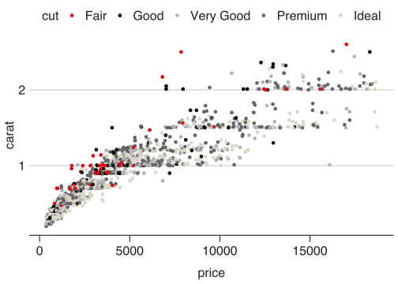
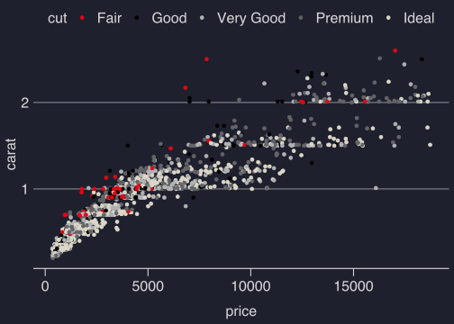
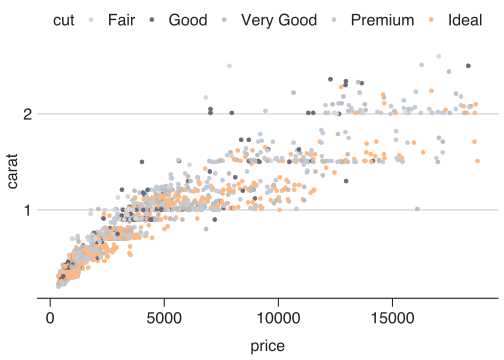
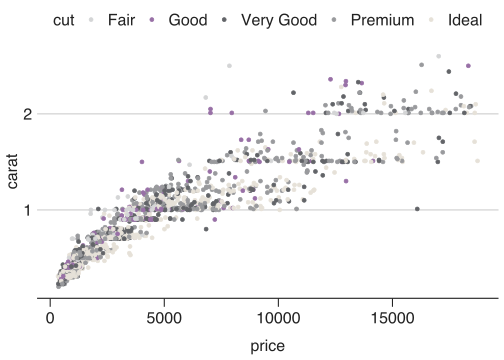

<!-- README.md is generated from README.Rmd. Please edit that file -->

# JLLify

JLLify is a package to apply JLL’s corporate colors to a ggplot object.
It also provides functions to apply a modern, clean theme to graphs, in
both light and dark themes.

## Installation

You can install latest version of JLLify from
[GitHub](https://github.com/) with:

``` r
# install.packages("devtools")
devtools::install_github("OwnKng/JLLify")
```

## Applying a JLL look to a ggplot graph

You can apply a JLL-look to a graph using the `theme_jll_modern()` and
`scale_color_jll()` functions. JLLify also provides a `scale_fill_jll()`
function for fill aesthetics.

``` r
library(ggplot2)
library(JLLify)

diamonds <- dplyr::sample_n(diamonds, size = 2000)

ggplot(data = diamonds, aes(price, carat)) + 
  geom_point(aes(color = cut)) +
  theme_jll_modern() + 
  scale_color_jll(palette = 'primary')
```



JLLify provides a ‘dark mode’ theme, which you can apply with the
function `theme_jll_modern_dark()`.

``` r
ggplot(data = diamonds, aes(price, carat)) + 
  geom_point(aes(color = cut)) +
  theme_jll_modern_dark() +
  scale_color_jll(palette = 'primary')
```

 \#\#
Applying the dataviz color palette The `scale_color_jll` and
`scale_fill_jll` functions have different palette options. You can
manually specify these, or use the default ‘data\_viz’ palette.

``` r
ggplot(data = diamonds, aes(price, carat)) + 
  geom_point(aes(color = cut)) +
  theme_jll_modern() + 
  scale_color_jll(palette = 'data_viz')
```



You can also retrieve part of a color palette using the
`jll_palette_cols()` function. This is useful if you know the number of
colors used in a plot, and want to apply them in the correct order.

``` r
cols <- jll_palette_cols(palette = 'data_viz', n = 5)

ggplot(data = diamonds, aes(price, carat)) + 
  geom_point(aes(color = cut)) +
  theme_jll_modern() + 
  scale_color_manual(values = cols)
```


